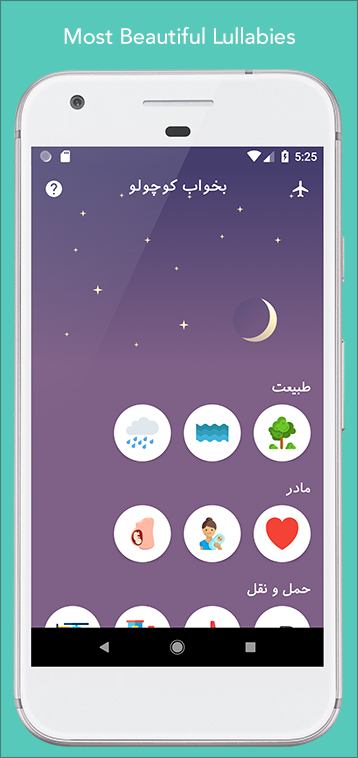
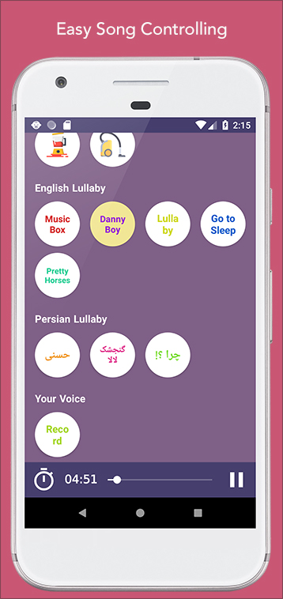
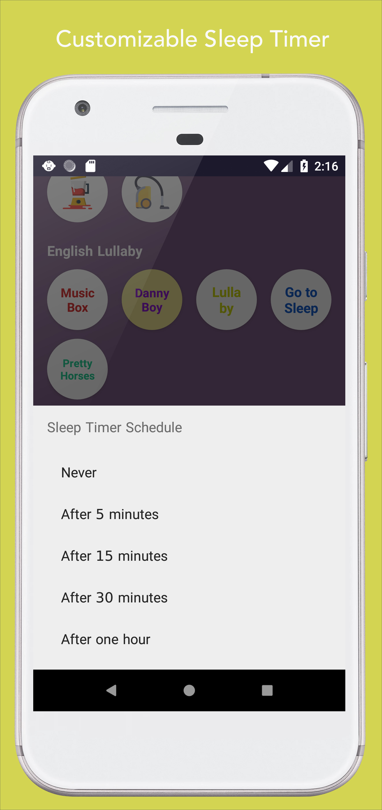
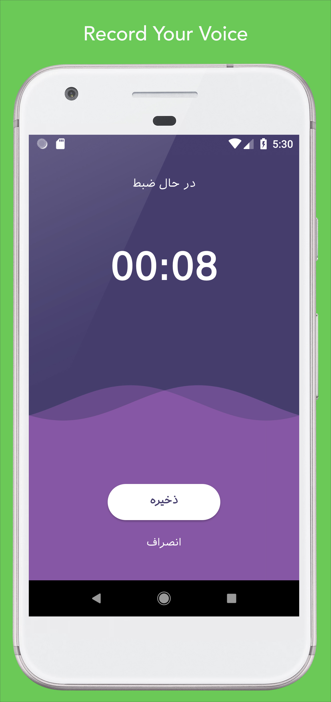

# Sleep Well Baby

The best collection of lullabies and white noises for babies (English, Persian), it also is open source under GPLv3 license. It doesn't miss any of main features. 

  
  
  

## Screenshots

  

